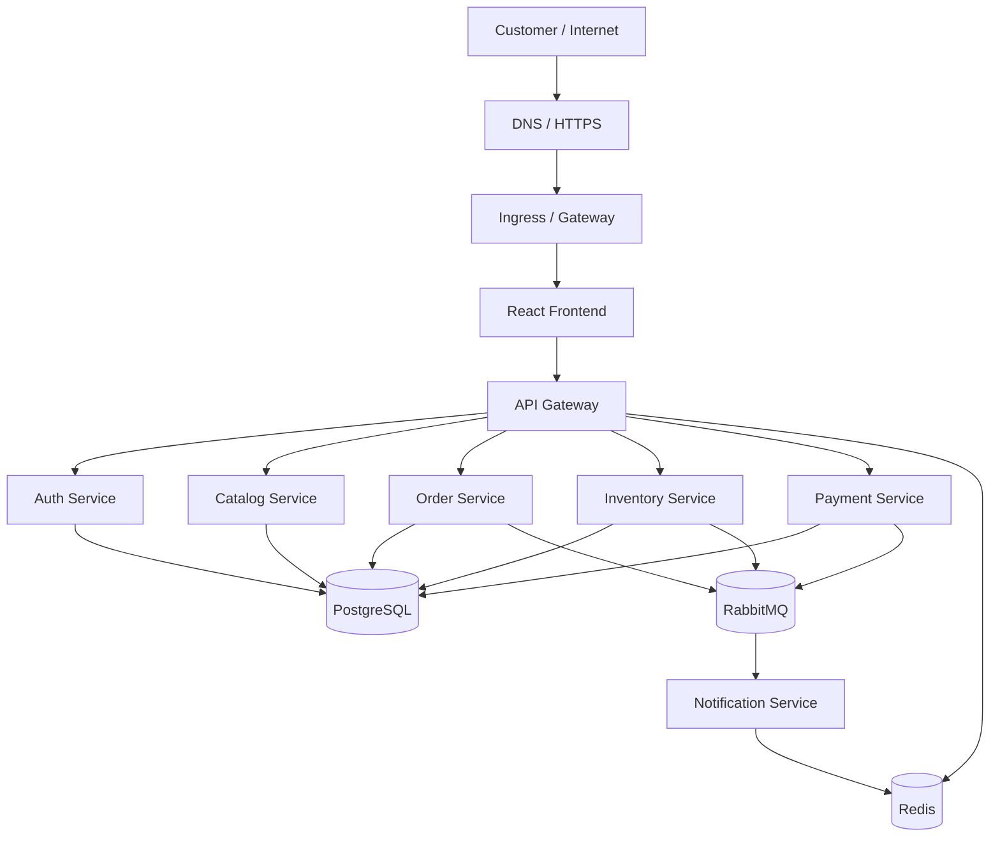
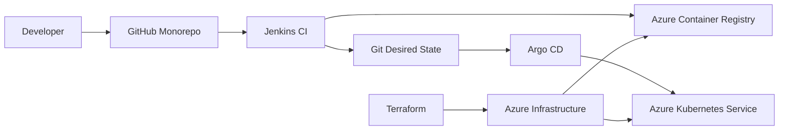
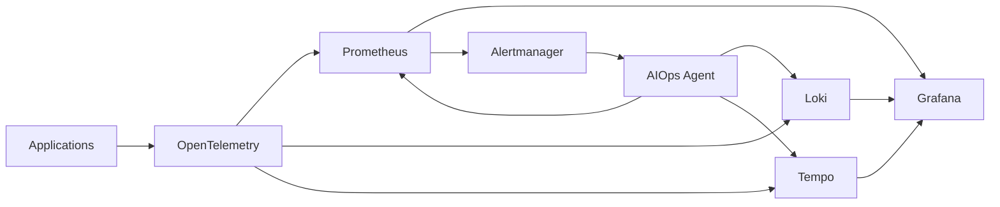
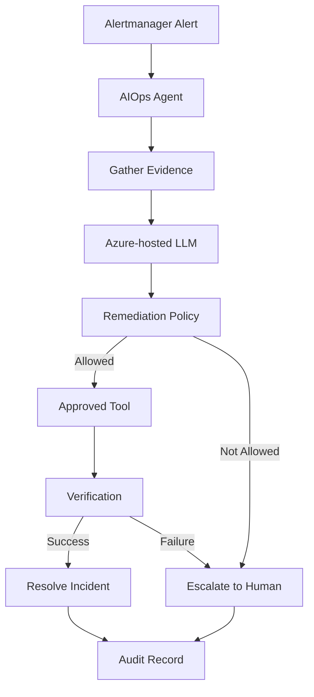

# ShopOps — Architecture & Engineering Standards

**Project:** ShopOps

**Purpose:** Portfolio and interview-grade cloud-native e-commerce platform

**Primary Cloud:** Microsoft Azure

**Kubernetes:** Azure Kubernetes Service (AKS)

**Application:** Node.js + TypeScript

**Repository:** Monorepo

**Status:** Phase 0 — Architecture & Engineering Standards

**Decision baseline:** October 2026

---

## 1. Document Purpose

This document is the engineering contract for the ShopOps project.

It defines:

- system architecture and service boundaries
- application and data ownership rules
- synchronous and asynchronous communication standards
- API and event contract standards
- reliability and observability requirements
- security and DevSecOps baseline
- repository, TypeScript, testing, and coding standards
- infrastructure and deployment principles
- GitOps and CI/CD responsibilities
- AIOps safety boundaries
- architectural decisions and non-goals

All future implementation work should follow this document unless a new Architecture Decision Record (ADR) explicitly changes a decision.

---

# 2. Project Objectives

ShopOps is intentionally built as a **production-style engineering laboratory**.

The application is not the primary objective. The platform and engineering practices are.

The project must demonstrate competence in:

1. Microservice architecture
2. TypeScript backend engineering
3. Containerization
4. Kubernetes
5. Azure and AKS
6. Infrastructure as Code with Terraform
7. CI/CD with Jenkins
8. Basic DevSecOps
9. GitOps with Argo CD
10. Helm-based deployment
11. Observability with OpenTelemetry, Prometheus, Grafana, Loki, and Tempo
12. Horizontal and Vertical Pod Autoscaling
13. SRE practices and failure engineering
14. Chaos engineering
15. Incident response and runbooks
16. LLM-powered AIOps
17. Controlled autonomous remediation

The project should be understandable, reproducible, inexpensive, and defensible in a technical interview.

---

# 3. Engineering Principles

## 3.1 Purpose Before Tooling

No technology is introduced merely because it is modern or popular.

Every component must satisfy at least one of these conditions:

- solve an actual system problem
- teach a deliberately chosen engineering concept
- provide evidence of a production practice

If a tool does none of these, it does not belong in the baseline architecture.

## 3.2 Simplicity Over Artificial Complexity

The system should have enough complexity to demonstrate distributed-systems and platform engineering skills, but not so much that the architecture becomes artificial.

Target microservice count: **5–7 business services plus an API gateway**.

We will not create dozens of tiny services merely to increase the service count.

## 3.3 Local-First Development

The majority of development must be possible without consuming Azure resources.

Local development should support:

- Docker
- PostgreSQL
- Redis
- RabbitMQ
- Kubernetes via kind or k3d
- Jenkins
- SonarQube
- Prometheus
- Grafana
- Loki
- Tempo
- Argo CD

Azure is primarily used for cloud-specific implementation and demonstration.

## 3.4 Immutable Artifacts

A built container image is treated as an immutable artifact.

Deployments should reference a specific image version or digest rather than an implicit mutable tag such as `latest`.

## 3.5 Declarative Infrastructure

Infrastructure and application desired state should be represented in source control.

Target model:

```text
Terraform → Azure infrastructure
Git       → desired application state
Argo CD   → Kubernetes reconciliation
```

## 3.6 Secure by Default

Security controls should be integrated into the normal engineering workflow instead of being added immediately before deployment.

## 3.7 Observable by Default

Every production-relevant service must emit enough telemetry to answer:

- Is it healthy?
- Is it receiving traffic?
- Is it slow?
- Is it returning errors?
- What dependency is causing the problem?
- What changed before the problem started?

## 3.8 Failure Is a First-Class Requirement

The system is intentionally designed to fail in controlled ways.

Failure scenarios are part of the architecture, not an afterthought.

## 3.9 Automation Must Be Reversible

Operational automation must have a clear verification path and, where practical, a rollback path.

This principle is especially important for AIOps remediation.

---

# 4. System Context

## 4.1 System Goal

ShopOps is a simplified e-commerce platform through which a customer can browse products and create orders. Orders pass through inventory and payment workflows, with asynchronous notifications.

The business workflow exists to produce realistic distributed-system behavior for the platform engineering layer.

## 4.2 Users

### Customer

Can:

- browse products
- authenticate
- create orders
- view order status
- cancel eligible orders

### Platform Operator

Can:

- inspect system health
- inspect deployments
- view dashboards
- inspect incidents
- approve or review remediation where required

### AIOps Agent

Can:

- inspect platform telemetry
- correlate incidents
- retrieve runbooks
- recommend remediation
- execute a limited set of approved remediation actions
- verify the result
- write an audit record

The AIOps agent is **not** an unrestricted administrator.

---

# 5. Target Architecture



## 5.1 Platform Architecture



## 5.2 Observability Architecture



---

# 6. Service Catalog and Boundaries

## 6.1 API Gateway

**Responsibility:** external API entry point.

Responsibilities:

- request routing
- authentication enforcement
- request correlation ID propagation
- API-level validation
- rate limiting where implemented
- hiding internal service topology from clients

The gateway should not contain business logic that belongs to individual services.

## 6.2 Auth Service

Owns:

- users
- credentials
- roles
- authentication tokens
- authentication-related state

Does not own orders, products, or inventory.

## 6.3 Catalog Service

Owns:

- products
- categories
- product metadata
- product availability as presented to customers

Catalog availability must not be treated as the authoritative inventory reservation mechanism.

## 6.4 Order Service

Owns:

- orders
- order status
- order items
- order lifecycle

The Order Service is the business owner of the order state machine.

## 6.5 Inventory Service

Owns:

- stock quantities
- stock reservations
- release of reservations

Only Inventory Service is allowed to mutate authoritative inventory state.

## 6.6 Payment Service

Owns:

- payment attempts
- payment status
- payment transaction state

For the initial project, payment processing is simulated rather than integrated with a real provider.

## 6.7 Notification Service

Owns:

- notification jobs
- notification status
- delivery simulation

It consumes domain events rather than coupling directly to the internal database of other services.

---

# 7. Database Ownership

## 7.1 Baseline

ShopOps will use a single PostgreSQL deployment for cost efficiency while maintaining **logical database ownership per service**.

Target model:

```text
PostgreSQL
│
├── auth_db
├── catalog_db
├── order_db
├── inventory_db
└── payment_db
```

## 7.2 Rules

1. A service may only write to its own database/schema.
2. A service must not directly query another service's tables.
3. Cross-service data access occurs through APIs or events.
4. Foreign keys must not cross service ownership boundaries.
5. Shared database access credentials between services should be avoided.
6. Database migrations belong to the owning service.
7. Destructive migrations require explicit review.

## 7.3 Why One PostgreSQL Instance?

Because this is a portfolio project rather than a production company system, separate database infrastructure for every service would add cost without improving the learning outcome proportionally.

Logical ownership gives us the architecture lesson without unnecessary infrastructure.

---

# 8. Communication Standards

ShopOps uses two communication patterns.

## 8.1 Synchronous Communication — REST/HTTP

Use REST/HTTP when:

- the caller needs an immediate response
- the operation is naturally request/response
- the caller must know success/failure immediately

Examples:

```text
Frontend → API Gateway
API Gateway → Catalog Service
API Gateway → Order Service
```

## 8.2 Asynchronous Communication — RabbitMQ

Use events when:

- processing can happen asynchronously
- multiple consumers may react to the same business event
- temporary consumer unavailability should not block the producer
- loose coupling is desirable

Initial events:

```text
OrderCreated
OrderCancelled
InventoryReserved
InventoryReservationFailed
PaymentRequested
PaymentCompleted
PaymentFailed
NotificationRequested
```

---

# 9. Event Standards

All events must have a consistent envelope.

Example:

```json
{
  "eventId": "uuid",
  "eventType": "OrderCreated",
  "eventVersion": 1,
  "occurredAt": "2026-10-03T10:00:00Z",
  "producer": "order-service",
  "correlationId": "uuid",
  "payload": {}
}
```

## 9.1 Event Rules

- Events must be versioned.
- Consumers must be tolerant of additive fields.
- Consumers should be idempotent.
- Consumers must log event IDs.
- Retries must be bounded.
- Failed messages should eventually reach a dead-letter queue.
- Message processing should expose metrics.
- Business events must not contain secrets.

## 9.2 Delivery Semantics

The baseline assumption is **at-least-once delivery**.

Therefore, consumers must assume duplicate delivery is possible.

---

# 10. API Standards

## 10.1 URL Style

Use plural resource nouns.

```text
GET    /api/v1/products
GET    /api/v1/products/:id
POST   /api/v1/orders
GET    /api/v1/orders/:id
POST   /api/v1/orders/:id/cancel
```

## 10.2 Versioning

External APIs begin at:

```text
/api/v1
```

Breaking changes require a new API version.

## 10.3 HTTP Status Codes

Use status codes consistently.

```text
200  successful read/update
201  resource created
202  accepted for asynchronous processing
204  successful operation with no response body
400  invalid request
401  unauthenticated
403  authenticated but unauthorized
404  resource not found
409  state/conflict condition
422  semantically invalid input
429  rate limited
500  unexpected server error
503  dependency/service temporarily unavailable
```

## 10.4 Validation

Request validation must occur at the API boundary.

Use Zod schemas for external input validation.

Never trust:

- path parameters
- query parameters
- request bodies
- HTTP headers supplied by clients

## 10.5 Error Response

Standard shape:

```json
{
  "error": {
    "code": "ORDER_NOT_FOUND",
    "message": "Order was not found",
    "requestId": "uuid"
  }
}
```

Do not return stack traces to clients.

---

# 11. Request Correlation

Every request entering the system must receive or propagate a correlation ID.

Header:

```text
X-Correlation-ID
```

Rules:

1. Preserve an existing trusted correlation ID where appropriate.
2. Generate one when missing.
3. Include it in application logs.
4. Propagate it across internal HTTP requests.
5. Propagate it into asynchronous event metadata.
6. Associate it with traces.

Goal:

```text
HTTP request
  ↓
Gateway
  ↓
Order Service
  ↓
RabbitMQ
  ↓
Inventory
  ↓
Payment
```

should be traceable as one logical transaction.

---

# 12. TypeScript Standards

## 12.1 Compiler

Use strict TypeScript.

Required principle:

```json
"strict": true
```

Avoid `any` except where explicitly justified.

## 12.2 Naming

Files:

```text
kebab-case.ts
```

Variables/functions:

```text
camelCase
```

Types/classes:

```text
PascalCase
```

Environment variables:

```text
UPPER_SNAKE_CASE
```

## 12.3 Layering

Each service should use a consistent structure such as:

```text
src/
├── config/
├── controllers/
├── routes/
├── services/
├── repositories/
├── schemas/
├── events/
├── middleware/
├── errors/
├── telemetry/
└── app.ts
```

Do not place business logic directly inside route handlers.

## 12.4 Dependency Direction

Preferred direction:

```text
Route
  ↓
Controller
  ↓
Service
  ↓
Repository
  ↓
Database
```

Infrastructure details should not leak into business/domain logic unnecessarily.

---

# 13. Configuration Standards

Configuration must come from environment-specific configuration, not hardcoded application source.

Examples:

```text
PORT
DATABASE_URL
REDIS_URL
RABBITMQ_URL
JWT_ISSUER
LOG_LEVEL
OTEL_EXPORTER_OTLP_ENDPOINT
```

## 13.1 Secrets

Never commit secrets to Git.

Do not hardcode:

- passwords
- API keys
- JWT secrets
- connection strings containing passwords
- Azure credentials

Development may use local `.env` files that are explicitly ignored by Git.

Cloud deployments will use Azure-managed secret mechanisms.

---

# 14. Logging Standards

Logs must be structured JSON in non-local environments.

Example:

```json
{
  "timestamp": "2026-10-03T10:00:00.000Z",
  "level": "info",
  "service": "order-service",
  "message": "Order created",
  "correlationId": "uuid",
  "orderId": "uuid"
}
```

Required contextual fields when available:

```text
timestamp
level
service
environment
message
correlationId
traceId
spanId
```

## 14.1 Logging Rules

Do log:

- state transitions
- failed requests
- dependency failures
- important asynchronous processing
- security-relevant events
- startup/shutdown

Do not log:

- passwords
- access tokens
- refresh tokens
- payment secrets
- sensitive credentials

---

# 15. Error Handling Standards

Errors must be classified as either:

```text
Expected business error
Unexpected application error
Dependency error
Infrastructure/platform error
```

Expected errors should be translated into stable API error codes.

Unexpected errors must:

1. be logged with context
2. include a correlation ID
3. avoid leaking internals to clients
4. increment an error metric where appropriate

Never silently swallow errors.

---

# 16. Reliability Standards

## 16.1 Service Health Endpoints

Every service must expose:

```text
GET /health
GET /ready
```

### `/health`

Answers whether the process is alive.

### `/ready`

Answers whether the service is ready to receive traffic.

Dependency checks should be carefully chosen so a temporary downstream problem does not necessarily cause cascading readiness failures.

## 16.2 Graceful Shutdown

Services must handle termination signals and stop accepting new work before exiting.

At minimum:

```text
SIGTERM
SIGINT
```

During shutdown:

1. stop accepting new work
2. allow in-flight work to complete where safe
3. close message consumers
4. close database connections
5. close Redis connections
6. close HTTP servers

## 16.3 Timeouts

All network calls must have explicit timeouts.

Never rely on an infinite default network timeout.

## 16.4 Retries

Retries are permitted only for failures that are plausibly transient.

Retry policies must have:

- maximum attempts
- backoff
- jitter where appropriate
- observability

Do not blindly retry non-idempotent operations.

---

# 17. Order State Machine

The Order Service owns order lifecycle state.

Initial states:

```text
PENDING
  ↓
INVENTORY_RESERVED
  ↓
PAYMENT_PROCESSING
  ↓
CONFIRMED
  ↓
SHIPPED
  ↓
DELIVERED
```

Failure/cancellation paths may include:

```text
PENDING → CANCELLED
INVENTORY_RESERVED → PAYMENT_FAILED
PAYMENT_PROCESSING → PAYMENT_FAILED
```

Invalid state transitions must be rejected explicitly.

---

# 18. Observability Standards

Observability is a core requirement, not an optional dashboarding phase.

## 18.1 Three Signals

Each service should emit:

```text
Metrics
Logs
Traces
```

using OpenTelemetry where practical.

## 18.2 Required Metrics

At minimum:

```text
HTTP request count
HTTP error count
HTTP request duration
in-flight requests where useful
process CPU usage
process memory usage
order count
payment success/failure count
inventory reservation failures
RabbitMQ consumer/queue metrics
```

## 18.3 Golden Signals

Dashboards must cover:

```text
Latency
Traffic
Errors
Saturation
```

## 18.4 Tracing

Distributed traces should follow a request across services.

A representative trace should be possible for:

```text
POST /orders
  ↓
API Gateway
  ↓
Order Service
  ↓
Inventory Service
  ↓
Payment Service
  ↓
Notification Service
```

## 18.5 Logs

Centralized logging must make it possible to identify:

- affected service
- affected instance/pod
- correlation ID
- trace ID
- recent errors
- recent deployment version

---

# 19. SLI / SLO Baseline

The initial SLOs are for demonstrating SRE thinking, not for claiming internet-scale production guarantees.

## 19.1 Availability SLO

Target:

```text
99.5% monthly availability
```

for the externally exposed API in the project environment.

## 19.2 Latency SLO

Target:

```text
95% of normal API requests < 500 ms
```

The exact threshold may be adjusted after realistic baseline measurements.

## 19.3 Error SLO

Target:

```text
HTTP 5xx rate < 1%
```

for normal operating periods.

## 19.4 Queue SLO

For async processing:

```text
95% of normal messages processed within 30 seconds
```

unless the operation intentionally represents a long-running workflow.

---

# 20. Alerting Standards

Alerts should be actionable.

An alert should answer:

- what is wrong?
- where is it wrong?
- how severe is it?
- how long has it been wrong?
- what signal triggered the alert?

Bad:

```text
CPU high
```

Better:

```text
HighCPUUsage
service=order-service
namespace=shopops-prod
cpu=92%
duration=10m
severity=warning
```

## 20.1 Initial Alerts

Implement alerts for:

1. high error rate
2. high latency
3. sustained CPU saturation
4. sustained memory saturation
5. repeated container restarts
6. OOMKilled pods
7. unavailable replicas
8. readiness failures
9. queue backlog
10. PostgreSQL connection pressure
11. node resource pressure
12. failed Argo CD synchronization

Alerts should avoid excessive noise.

---

# 21. Kubernetes Standards

These standards apply when the application is containerized and deployed to Kubernetes.

## 21.1 Namespaces

Use environment/application isolation.

Initial approach:

```text
shopops-dev
shopops-prod
```

Observability/infrastructure components may use dedicated namespaces.

## 21.2 Resource Requests and Limits

Every workload must define CPU and memory requests.

Limits should be based on measured behavior rather than arbitrary large values.

## 21.3 Probes

Use:

```text
startupProbe
readinessProbe
livenessProbe
```

where appropriate.

## 21.4 Pod Disruption Budget

Stateless production services should use a reasonable PDB where multiple replicas exist.

## 21.5 Security Context

Containers should run as non-root where the application permits.

## 21.6 RBAC

Use least privilege.

Service accounts should receive only the Kubernetes permissions required by that workload.

## 21.7 NetworkPolicy

Default principle:

```text
Do not allow every pod to talk to every other pod without a reason.
```

Network policies should restrict unnecessary east-west traffic where supported by the chosen AKS networking configuration.

---

# 22. Autoscaling Standards

## 22.1 HPA

Use HPA for services where load-driven replica scaling is meaningful.

Initial signals:

- CPU utilization
- memory utilization where justified

Future enhancement:

- request rate
- queue depth
- custom business metrics

## 22.2 VPA

Use VPA primarily as a resource-sizing and recommendation mechanism initially.

Do not introduce VPA automation that fights HPA or causes unstable scaling behavior without measurement.

## 22.3 Cluster Autoscaling

Use node autoscaling only when workload demands justify it and cloud budget permits.

---

# 23. Helm Standards

Each deployable service must be represented by a reusable Helm chart or a clearly standardized shared chart strategy.

Minimum chart concepts:

```text
Chart.yaml
values.yaml
templates/
_helpers.tpl
```

## 23.1 Values Separation

Environment-specific values must not be duplicated across arbitrary manifests.

Use:

```text
values-dev.yaml
values-prod.yaml
```

or a comparable GitOps values strategy.

## 23.2 Secrets

Plaintext production secrets must never be stored in GitOps values files.

---

# 24. Terraform Standards

Terraform is the source of truth for Azure infrastructure.

## 24.1 Module Boundaries

Initial modules:

```text
network
aks
acr
postgres
keyvault
monitoring
```

## 24.2 Environment Boundaries

Use:

```text
environments/
├── dev/
└── prod/
```

A full duplicate production environment is not required during the initial cost-constrained phase.

## 24.3 State

Terraform state must not be committed to Git.

Use an Azure-backed remote state strategy once the cloud environment is introduced.

## 24.4 Terraform Workflow

Standard workflow:

```text
terraform fmt
terraform validate
terraform plan
terraform apply
```

Destructive changes require explicit inspection of the plan.

---

# 25. Azure Standards

Primary cloud services:

```text
Azure Resource Group
Azure VNet
AKS
Azure Container Registry
Azure Database for PostgreSQL Flexible Server
Azure Key Vault
Azure Storage
Azure Monitor / related native telemetry as appropriate
```

## 25.1 Identity

Prefer:

```text
Managed Identity
Workload Identity
```

over long-lived cloud access keys.

## 25.2 Cost Control

Azure is a temporary learning environment.

Rules:

1. Use the smallest practical resources.
2. Do not leave unnecessary resources running.
3. Use local services whenever cloud resources are not required.
4. Destroy temporary lab infrastructure after demonstrations.
5. Track Azure spending before introducing additional components.
6. Avoid multi-region and multi-cluster deployment in the baseline project.

---

# 26. CI Standards — Jenkins

Jenkins owns **continuous integration and artifact production**.

Jenkins does not become the production deployment authority.

Initial pipeline:

```text
Checkout
  ↓
Install dependencies
  ↓
Lint
  ↓
Unit tests
  ↓
SonarQube analysis
  ↓
Gitleaks
  ↓
Dependency/SCA checks
  ↓
Docker build
  ↓
Trivy image scan
  ↓
SBOM generation
  ↓
Push image to ACR
  ↓
Update GitOps desired state
```

## 26.1 CI Quality Gates

Pipeline failures should block artifact publication when a configured mandatory gate fails.

Thresholds should be documented rather than hidden inside scripts.

---

# 27. DevSecOps Baseline

Because the project explicitly targets a **basic** DevSecOps implementation, the baseline will be intentionally focused.

Required:

```text
SonarQube
Gitleaks
Trivy
Dependency scanning
SBOM
Kubernetes RBAC
NetworkPolicy
Key Vault / secret management
```

Optional stretch:

```text
Cosign image signing
```

We are intentionally not adding a large security platform stack unless a concrete requirement appears.

---

# 28. GitOps Standards

Argo CD owns synchronization of Kubernetes desired state.

## 28.1 Responsibility Split

```text
Jenkins
  → build
  → test
  → scan
  → publish image
  → update desired state

Git
  → desired application configuration

Argo CD
  → reconcile Git state into AKS
```

## 28.2 Forbidden Production Pattern

Do not use this as the normal production path:

```text
Jenkins → kubectl apply → production
```

## 28.3 Drift

Manual cluster changes are considered drift unless explicitly part of an operational emergency.

A manual emergency change must eventually be represented in Git.

---

# 29. Testing Standards

Testing strategy:

```text
Unit tests
Integration tests
API tests
Contract-focused event tests
Container verification
Kubernetes smoke tests
Load tests
Failure/chaos experiments
```

The project does not need exhaustive enterprise test coverage.

The purpose is to show that infrastructure automation is backed by meaningful application verification.

---

# 30. Load Testing Standards

Use k6 for reproducible load scenarios.

Initial scenarios:

```text
Normal traffic
Moderate traffic spike
Sustained high traffic
Order burst
Catalog-heavy traffic
```

The objective is to demonstrate:

```text
load
 ↓
resource pressure
 ↓
HPA
 ↓
more replicas
 ↓
observed recovery
```

---

# 31. Failure Engineering Standards

Failure is intentionally injected into the system.

Initial failure catalog:

| Failure | Expected Detection | Possible Remediation |
|---|---|---|
| Pod crash | restart/availability alert | Kubernetes self-healing |
| Repeated crashes | restart alert | investigate deployment/logs |
| OOMKilled | memory/restart alert | restart, investigate resources |
| CPU saturation | CPU alert | HPA scaling |
| High latency | latency alert | investigate dependency/load |
| HTTP 5xx spike | error alert | investigate logs/traces/recent deploy |
| RabbitMQ backlog | queue alert | scale consumer / inspect consumer |
| DB connection pressure | DB alert | investigate pool/traffic |
| Bad deployment | errors + Argo state | rollback |
| Readiness failure | unavailable replica | restart/rollback based on evidence |
| Node pressure | node alert | reschedule / scale node capacity |

---

# 32. Chaos Engineering Standards

Chaos engineering will be introduced only after normal observability and alerting work.

## 32.1 Progression

### Stage 1 — Manual failures

Use Kubernetes commands to understand failure behavior.

Examples:

```text
kubectl delete pod
kubectl scale deployment
kubectl rollout undo deployment
```

### Stage 2 — Controlled automated experiments

Introduce Chaos Mesh after baseline behavior is understood.

## 32.2 Experiment Rules

Every chaos experiment must define:

```text
Hypothesis
Blast radius
Duration
Expected signal
Expected recovery
Abort condition
Result
```

No uncontrolled failure experiments on expensive or shared infrastructure.

---

# 33. AIOps Architecture Standards

The AIOps agent is an operational assistant with limited automation authority.

## 33.1 Agent Capabilities

### Read tools

```text
getClusterHealth()
getPods()
getDeployments()
getEvents()
getNodeHealth()
queryPrometheus()
queryLogs()
queryTraces()
getArgoCDStatus()
getRecentDeployments()
getJenkinsBuild()
getGitChanges()
readRunbook()
```

### Remediation tools

Initial allowed actions:

```text
restartDeployment()
rollbackDeployment()
scaleDeployment()
pauseRollout()
```

## 33.2 Hard Boundary

The agent must NOT receive a generic arbitrary command execution tool.

Forbidden baseline capability:

```text
executeShell(command)
```

The agent should interact only through narrowly scoped, typed tools.

---

# 34. AIOps Decision Flow



---

# 35. AIOps Autonomy Levels

## Level 1 — Observe

The agent only reads telemetry and explains what is happening.

## Level 2 — Recommend

The agent identifies a likely root cause and proposes remediation.

## Level 3 — Controlled Autonomous Remediation

The agent can execute pre-approved, low-risk actions.

The project target is **Level 3**.

---

# 36. AIOps Safety Policy

Before any autonomous remediation:

1. Verify the target resource.
2. Verify that the action is allowed for that resource type.
3. Verify that the environment permits autonomous actions.
4. Verify blast radius.
5. Prefer reversible operations.
6. Execute only a predefined typed action.
7. Observe the system after the action.
8. Verify success using measurable signals.
9. Escalate if verification fails.
10. Record the complete action and evidence trail.

Example:

```text
Alert
 ↓
Diagnosis
 ↓
Rollback recommended
 ↓
Policy: rollback allowed for production order-service
 ↓
Argo CD rollback/tool execution
 ↓
Observe 5xx + latency + replicas
 ↓
Healthy
 ↓
Close incident
```

---

# 37. AIOps Audit Requirements

Every automated action should produce an audit object containing at minimum:

```text
incidentId
alertName
severity
timestamp
agentVersion
modelVersion if available
evidenceSummary
diagnosis
selectedAction
targetResource
policyDecision
executionResult
verificationResult
finalStatus
```

The audit trail is part of the portfolio demonstration.

---

# 38. Runbook Standards

Every alert that can result in remediation should eventually have a runbook.

Runbook structure:

```text
Title
Symptoms
Impact
Relevant metrics
Relevant logs
Likely causes
Diagnostic commands/tools
Safe remediation
Verification
Rollback
Escalation
```

The AIOps agent may retrieve and use runbooks as operational context.

---

# 39. Git and Branching Standards

Recommended branches:

```text
main
feature/*
fix/*
chore/*
```

`main` should remain deployable.

Feature branches should be short-lived.

Pull requests should describe:

- problem
- implementation
- testing
- operational impact
- security impact where relevant

---

# 40. Commit Standards

Use descriptive conventional-style commit messages.

Examples:

```text
feat(order): add order creation flow
fix(inventory): prevent duplicate reservations
ci(jenkins): add trivy image scanning
docs(adr): define rabbitmq event strategy
infra(aks): add workload identity
```

Commits should represent coherent changes rather than large unrelated bundles.

---

# 41. ADR Standards

Important architecture decisions must be documented as ADRs.

Initial ADR backlog:

```text
ADR-001 — Overall system architecture
ADR-002 — Microservice boundaries
ADR-003 — PostgreSQL logical database ownership
ADR-004 — REST vs asynchronous messaging
ADR-005 — RabbitMQ event strategy
ADR-006 — Azure + AKS as primary cloud
ADR-007 — Terraform as infrastructure source of truth
ADR-008 — Jenkins for CI
ADR-009 — Argo CD for GitOps CD
ADR-010 — OpenTelemetry-based observability
ADR-011 — Chaos engineering approach
ADR-012 — AIOps tool-based controlled remediation
```

ADR template:

```text
# ADR-XXX: Title

## Status
Accepted / Proposed / Superseded

## Context
What problem are we solving?

## Decision
What did we choose?

## Alternatives
What else did we consider?

## Consequences
What are the benefits and trade-offs?
```

---

# 42. Documentation Standards

The repository must contain:

```text
README.md
architecture diagrams
ADR directory
service documentation
API documentation
runbooks
incident reports
CI/CD documentation
local setup guide
cloud deployment guide
AIOps documentation
```

The documentation should allow a technically competent developer to understand the system without a live explanation.

---

# 43. Definition of Done

A feature is considered complete only when applicable engineering requirements have been satisfied.

For an application feature:

```text
Code
Tests
Validation
Logging
Metrics where meaningful
Error handling
Documentation
```

For infrastructure:

```text
Terraform
Plan verification
Security review
Outputs/documentation
```

For deployment:

```text
Helm
GitOps
Health verification
Rollback path
```

For reliability work:

```text
Metric
Alert if required
Dashboard
Runbook
Failure test
```

For AIOps work:

```text
Tool definition
Permission boundary
Policy
Action
Verification
Audit trail
Failure/escalation behavior
```

---

# 44. Non-Goals

The following are explicitly outside the baseline scope:

- multi-region production architecture
- multi-cloud deployment
- real payment processing
- real customer PII at production scale
- dozens of microservices
- service mesh
- arbitrary AI shell access
- autonomous changes to Terraform infrastructure
- autonomous modification of security policies
- autonomous deletion of persistent resources
- 24/7 paid cloud hosting
- enterprise-grade SOC tooling

These may be discussed as future improvements but are not part of the core implementation.

---

# 45. Future Stretch Goals

Possible extensions after the core project is complete:

```text
Cosign image signing
Kyverno/OPA policy enforcement
OpenTelemetry Collector
custom Prometheus metrics for HPA
Kafka comparison experiment
Azure Managed Grafana comparison
Azure Monitor integration
service mesh comparison
Argo Rollouts / canary delivery
progressive deployment analysis
AIOps incident memory
post-incident summarization
automated postmortem generation
```

Stretch work should never destabilize the core project.

---

# 46. Reference Incident Scenarios

The final portfolio demonstration should include at least these incidents.

## Incident 1 — Pod Crash

```text
Inject crash
→ Kubernetes restarts pod
→ alert if repeated
→ dashboard reflects recovery
```

Learning:

```text
Kubernetes self-healing
```

## Incident 2 — CPU Saturation

```text
Load test
→ CPU rises
→ HPA scales
→ latency stabilizes
```

Learning:

```text
HPA + observability + load testing
```

## Incident 3 — Bad Deployment

```text
Deploy intentionally faulty version
→ 5xx increases
→ latency increases
→ telemetry correlates with deployment
→ AIOps identifies regression
→ rollback
→ verify recovery
```

Learning:

```text
GitOps + observability + incident response + AIOps
```

## Incident 4 — Queue Backlog

```text
Stop/slow consumer
→ queue depth increases
→ alert fires
→ agent investigates
→ consumer scaled/restarted
→ backlog drains
```

Learning:

```text
messaging + scaling + automated remediation
```

---

# 47. Portfolio Evidence Requirements

The project should produce visible evidence of engineering work.

Recommended evidence:

```text
Architecture diagram
Terraform plan/apply
AKS cluster
Jenkins pipeline
Security scan results
Docker image in ACR
Argo CD application
Helm charts
Grafana dashboards
Prometheus alerts
Distributed trace
Chaos experiment
Incident report
AIOps investigation
AIOps remediation audit
```

The GitHub repository should make these easy to discover.

---

# 48. Phase 0 Deliverables

Before starting application implementation, complete the following.

## Required

- [x] Project objective defined
- [x] Cloud decision: Azure/AKS
- [x] Application domain: e-commerce
- [x] Node.js + TypeScript decision
- [x] Monorepo decision
- [x] Service boundary proposal
- [x] Communication model
- [x] Database ownership model
- [x] Observability direction
- [x] CI/CD responsibility split
- [x] GitOps responsibility split
- [x] DevSecOps baseline
- [x] Reliability baseline
- [x] AIOps autonomy model
- [x] AIOps security boundary

## Still to Implement

- [ ] Repository skeleton
- [ ] ADR files
- [ ] Architecture diagrams in `/docs`
- [ ] Service API contracts
- [ ] Event schemas
- [ ] Initial SLO measurement plan
- [ ] Failure catalog YAML/Markdown
- [ ] Local developer setup
- [ ] Coding/tooling configuration

---

# 49. Phase 1 Entry Criteria

We may begin application implementation when these questions have concrete answers:

### Architecture

- What does each service own?
- Which calls are synchronous?
- Which events exist?
- Who owns each piece of data?

### Reliability

- What does healthy mean?
- What are our first SLOs?
- What failures do we expect?

### Operations

- What must be observable?
- What should generate an alert?
- Which remediation actions could eventually be automated safely?

### Engineering

- How are services structured?
- How are APIs versioned?
- How are errors represented?
- How are tests organized?

### Security

- Where do secrets live?
- What is the minimum required access for each component?
- What security checks belong in CI?

---

# 50. Final Architecture Decision Summary

| Area | Decision |
|---|---|
| Business domain | E-commerce |
| Primary cloud | Microsoft Azure |
| Kubernetes | AKS |
| Application runtime | Node.js |
| Language | TypeScript |
| Frontend | React + TypeScript |
| API style | REST/HTTP |
| Async messaging | RabbitMQ |
| Database | PostgreSQL |
| Cache | Redis |
| Containers | Docker |
| Local Kubernetes | kind/k3d |
| IaC | Terraform |
| CI | Jenkins |
| Registry | Azure Container Registry |
| CD/GitOps | Argo CD |
| Packaging | Helm |
| Metrics | Prometheus |
| Dashboards | Grafana |
| Logs | Loki |
| Traces | Tempo |
| Telemetry | OpenTelemetry |
| Load testing | k6 |
| SAST | SonarQube |
| Secret scanning | Gitleaks |
| Vulnerability scanning | Trivy |
| SBOM | Syft |
| Secrets | Azure Key Vault |
| Scaling | HPA + VPA |
| Chaos | Chaos Mesh |
| AI | Azure-hosted LLM |
| AIOps | Custom TypeScript agent with tool calling |
| AI autonomy | Controlled autonomous remediation |
| Repository | Monorepo |
| Cloud cost strategy | Free tier/credits + destroy lab resources |
| Project duration | ~16 weekends / ~128 hours |
| Portfolio focus | Production-style DevOps/SRE/AIOps showcase |

---

# 51. Architecture North Star

The final system should demonstrate this complete chain:

```text
Business Application
       ↓
Microservices
       ↓
Containers
       ↓
Kubernetes
       ↓
Terraform
       ↓
Azure AKS
       ↓
Jenkins CI
       ↓
DevSecOps
       ↓
ACR
       ↓
GitOps
       ↓
Argo CD
       ↓
Helm
       ↓
Observability
       ↓
SLOs + Alerting
       ↓
Autoscaling
       ↓
Chaos Engineering
       ↓
Incident Response
       ↓
AIOps Investigation
       ↓
Policy-Controlled Remediation
       ↓
Automated Verification
       ↓
Audit Trail
```

**This is the engineering contract for the ShopOps project.**

Future implementation decisions should either fit this architecture or be documented as an explicit ADR when they intentionally change it.
